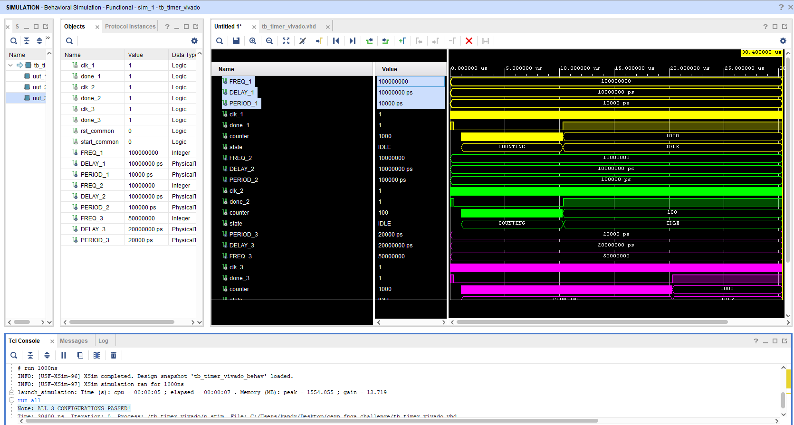
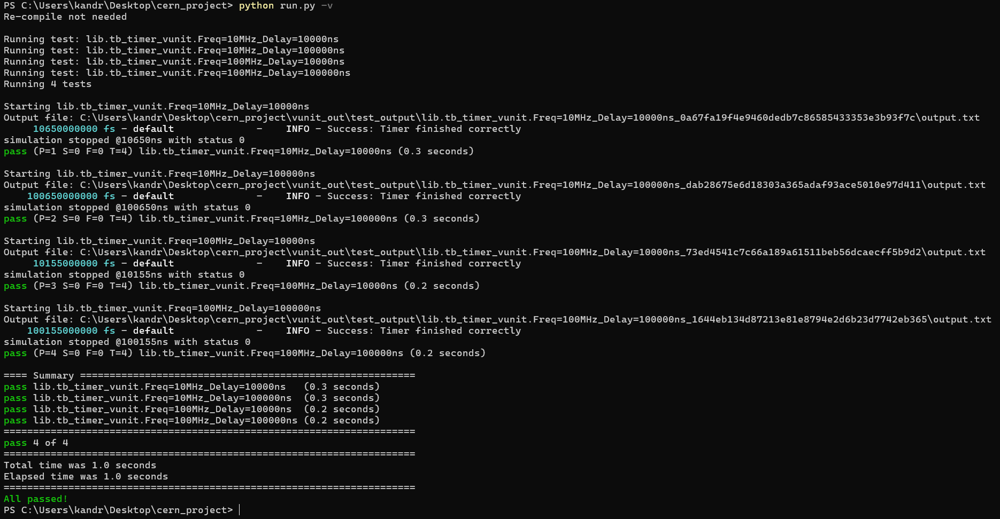

# FPGA Verification Demo Testbenches

I used tb_timer_vivado.vhd to write and verify the RTL code locally. This allowed me to debug the logic using Vivado waveforms before running automation.

After confirming the logic, I ran the VUnit automation suite to verify the design against all four required test cases. All tests passed successfully.

